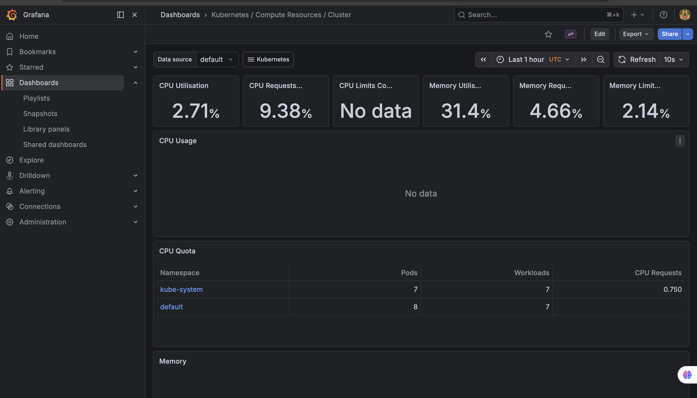
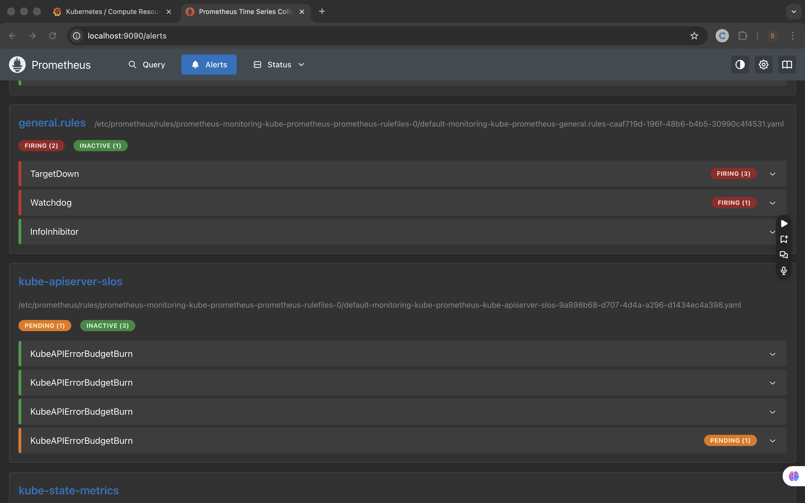
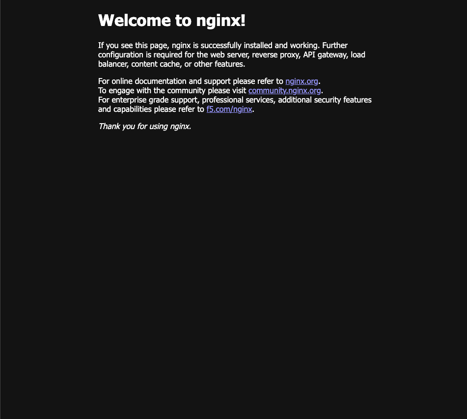

# Kubernetes Monitoring Stack

A production-style Kubernetes cluster with a full observability stack — Prometheus for metrics collection, Grafana for real-time dashboards, and Alertmanager for automated alerting on CPU, memory, and pod health.

---

## Live Dashboard

Grafana running at `http://localhost:3000` (via port-forward)  
Prometheus running at `http://localhost:9090` (via port-forward)

---

## Architecture

```
Kubernetes Cluster (minikube)
        │
        ├── Web Application
        │     ├── nginx Pod 1
        │     └── nginx Pod 2
        │
        ├── Prometheus
        │     └── Scrapes metrics from all pods and nodes
        │
        ├── Grafana
        │     └── Visualizes metrics in real-time dashboards
        │
        └── Alertmanager
              └── Fires alerts when thresholds are breached
```

---

## Technologies Used

- **Kubernetes** — container orchestration platform
- **Minikube** — local Kubernetes cluster
- **Helm** — Kubernetes package manager
- **Prometheus** — metrics collection and alerting engine
- **Grafana** — real-time monitoring dashboards
- **Alertmanager** — alert routing and notification management
- **kubectl** — Kubernetes CLI

---

## Project Structure

```
kubernetes-monitoring/
├── app/
│   └── deployment.yaml       # Web app deployment and service
└── alert-rules.yaml          # Prometheus alerting rules
```

---

## Alert Rules Configured

| Alert | Condition | Severity |
|-------|-----------|----------|
| HighCPUUsage | CPU > 80% for 1 minute | Warning |
| HighMemoryUsage | Memory > 80% for 1 minute | Warning |
| PodCrashLooping | Pod restarts > 0 in 15 minutes | Critical |

---

## How to Deploy

### Prerequisites
- Docker Desktop installed and running
- Minikube installed (`brew install minikube`)
- Helm installed (`brew install helm`)
- kubectl installed (`brew install kubernetes-cli`)

### Steps

```bash
# 1. Clone the repository
git clone https://github.com/Samuelaliu/kubernetes-monitoring.git
cd kubernetes-monitoring

# 2. Start minikube cluster
minikube start --driver=docker

# 3. Deploy the web application
kubectl apply -f app/deployment.yaml

# 4. Add Prometheus Helm repo
helm repo add prometheus-community https://prometheus-community.github.io/helm-charts
helm repo update

# 5. Install monitoring stack
helm install monitoring prometheus-community/kube-prometheus-stack

# 6. Apply alert rules
kubectl apply -f alert-rules.yaml

# 7. Verify all pods are running
kubectl get pods
```

### Access Grafana

```bash
# Get admin password
kubectl get secret --namespace default monitoring-grafana \
  -o jsonpath="{.data.admin-password}" | base64 --decode ; echo

# Forward Grafana port
kubectl port-forward deployment/monitoring-grafana 3000

# Open browser at http://localhost:3000
# Username: admin
# Password: (from command above)
```

### Access Prometheus

```bash
kubectl port-forward svc/monitoring-kube-prometheus-prometheus 9090
# Open browser at http://localhost:9090/alerts
```

### Access Web App

```bash
minikube service web-app-service
```

---

## Screenshots

### Grafana — Kubernetes Cluster Dashboard


### Prometheus — Alert Rules Firing


### Web App Running on Kubernetes


---

## Key Concepts Demonstrated

**Container Orchestration** — Kubernetes automatically manages 2 replicas of the web app, restarting them if they crash and load balancing traffic between them.

**Infrastructure as Code** — All deployments are defined in YAML files, making the entire setup reproducible and version controlled.

**Observability** — The three pillars of observability are covered: metrics (Prometheus), visualization (Grafana), and alerting (Alertmanager).

**Helm Package Management** — The entire monitoring stack was deployed with a single Helm command instead of managing dozens of individual YAML files.

---

## Lessons Learned

- Kubernetes pods go through several states (Pending → ContainerCreating → Running) — patience is key when waiting for images to pull
- Helm dramatically simplifies deploying complex multi-component applications
- Prometheus alert rules use PromQL — a powerful query language for time-series metrics
- Port forwarding is needed to access cluster services locally when using minikube

---

## Cleanup

```bash
# Stop the cluster (preserves state)
minikube stop

# Delete the cluster completely
minikube delete
```

---

## Author

**Samuel Aliu** — IT Support Specialist & Cloud Infrastructure Engineer  
[GitHub](https://github.com/Samuelaliu) • [LinkedIn](https://www.linkedin.com/in/aliusamuel/)
